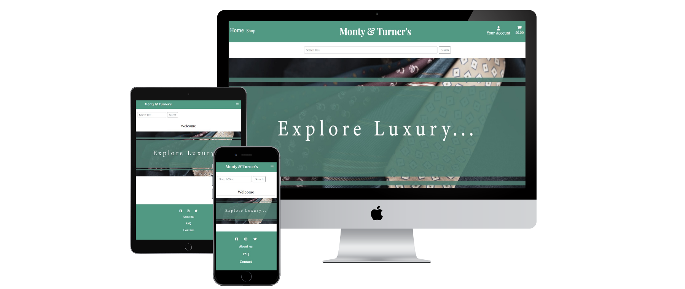
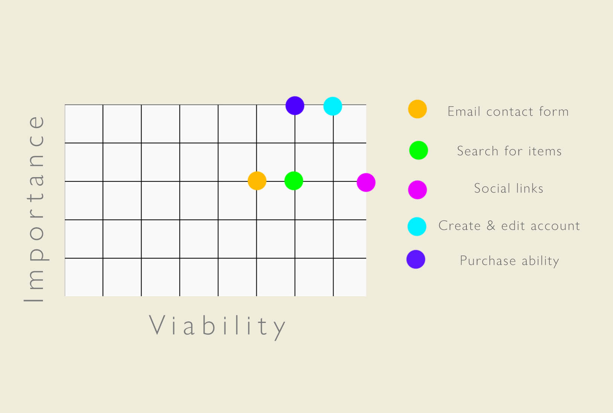
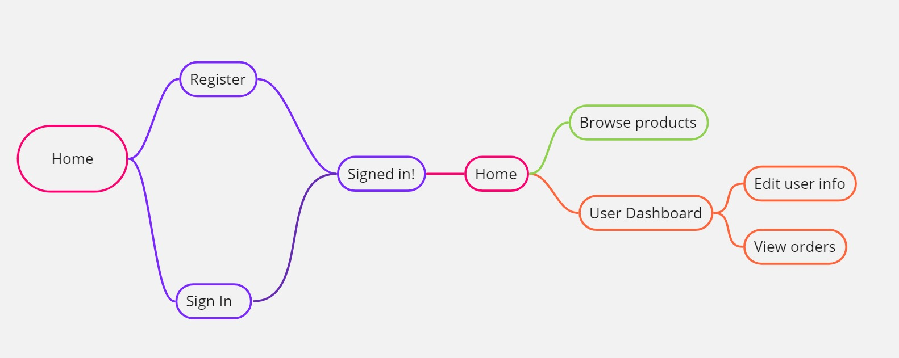
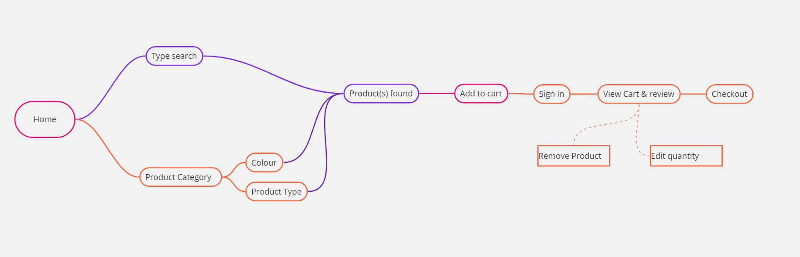
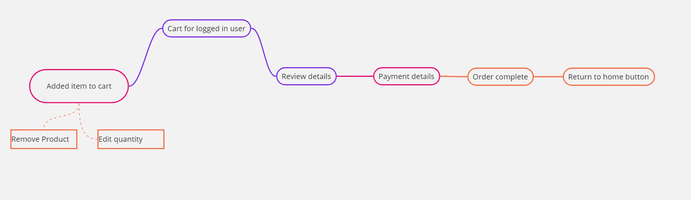
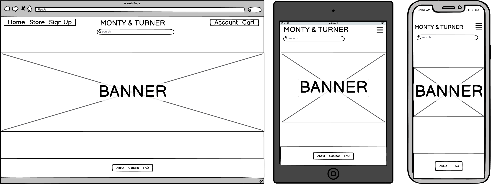
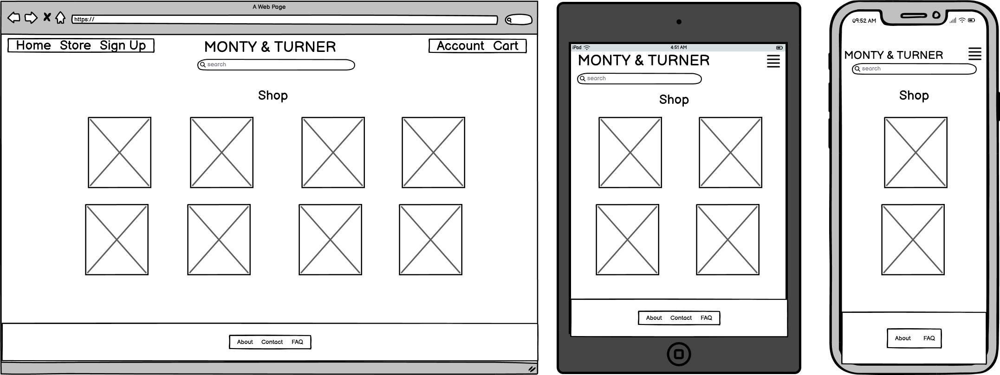
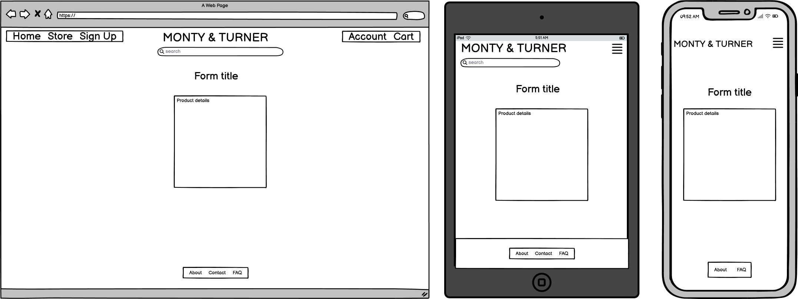

# Monty & Turner's Tie Emporium

## Code Institute Milestone Project 4

[Click here to view the live project](https://tie-shop-2460624fe7ee.herokuapp.com/)

- [M&T Tie Emporium](#monty--turners-tie-emporium)
  - [Table of Contents](#table-of-contents)
  - [Introduction](#introduction)
  - [UX](#ux)
  - [Development Planes](#development-planes)
  - [Features](#features)
  - [Issues and Bugs](#issues-and-bugs)
  - [Technology Used](#technologies-used)
  - [Testing](#testing)
  - [Deployment](#deployment)
  - [Credits](#credits)
  - [Acknowledgements](#acknowledgements)

## Introduction

Welcome to my README for Monty & Turner's Tie Emporium, an excellent place to find a great selection of high quality ties. The purpose of this website is to allow new and existing customers to browse a range of ties in an intuitive way and easily find information regarding the ties. 

The customers will of course be able to purchase a tie and this will involve signing up and logging into their personal account. Ease of use is very important as a frustrated customer is less likely to make a purchase. The aim was to allow the purchase of a tie in as few steps as possible.

This was the fourth Milestone Projects as part of my course at the Code Institute. The main requirements were to make a full stack django project, with multiple apps, use of stripe payment, at least one form of validation, an authentication method, some frontend javascript and finally at least two custom django models.

---

## UX

### Demographics

The aim for me is to create a website that appeals to:

- New users
- Current users
- Store Owner

### User Stories

#### New Users

- As a new user I want to be able to browse relevant products
- As a new user I want to be able to contact the site owner
- As a new user I want to be able to sign up and create a personal account
- As a new user I want to be able to connect with the business via social sites

#### Current Users

- As a current user I want to be able view products as I did as a new user
- As a current user I want to be able to log in to my personal account and view my personal data
- As a current user I want to be able to securely edit my data
- As a current user I want to be able to add products I am interested in to my cart for later
- As a current user I want to be able to edit the items in my cart by either removing them or changing the quantity
- As a current user I want to be able to securely checkout the items in my cart to complete an order
- As a current user I want an order confirmation sent to my email to give me details of that order

#### Store Owner

- As a store owner, I want to be able to login to a secure store owner account
- As a store owner, I want to be able to add new products to my store
- As a store owner, I want to be able to edit and remove unwanted products
- As a store owner, I want to be able to edit some of the content of the site

---

## Development Planes

#### Strategy

To design a site that fits the users needs, the following development planes were consulted to assist with answering the user stories.

- roles

  - Current users
  - New Users

- Demographic
  - Interested in menswear
  - Adults
  - Seeking high quality men's accessories
  - Western demographic, focus on united kingdom

- Psychographic
  - Lifestyles
    - Potential office workers
    - Users who frequently adpot formal attire

- Personality and Attitudes 
  - Professionals
  - Attention to detail
  - Social

- Values
  - Focus on maintaining smart appearance
  - Appreciates high quality 
  - Appreciates wide choice of selective items

This website needs to enable the user to:

- Create an account and login
- Purchase a tie or multiple ties
- Edit and save user info (email, physical address)
- Contact the site owner
- visit site social links

This website needs to enable the owner to:

- Display available products
- Provide a point of contact
- Provide information about the site

With this in mind I have produced a short diagram representing the viability of elements versus importance within the site.

Viability chart

[Back to top](#monty--turners-tie-emporium)

---

### Scope

Based on the requirements of the Strategy plane, I have identified two categories.

- Content Requirements:
  - Products (ties)
    - categories will be colour and material 
    - images of each product
  - Contact form for emailing site owner
  - Login/sign up form
  - User dashboard 
    - Edit user email and physical address
    - View past orders
    - User wishlist
- Function Requirements:
  - Users can search for key words via a search bar
  - Users can select a category of ties
    -Categories will be colour and material
  - Sign in page and sign up page
  - User dashboard
    - Edit user data
    - User wishlist (add and remove products)
  - Cart for items selected to buy
    - Edit quantity and remove items from cart
    - Complete checkout from cart
  - Contact site owner via form
  - Edit/Add/Delete products

---

### Structure

Based on the information so far, 

The intended path will be as follows:

#### Path for first visit account creation and sign in

 

Expand for map

 

#### Path for finding and adding product to basket

 

Expand for map

 #### Path for purchasing an item

Expand for map

---

### Skeleton

Wireframes were produced using balsamiq. These will showcase the site as intended on mobile and desktop. I created these wireframes at the beginning of the project as an approximate guideline on positioning of elements on the pages. 
I knew that a lot of pages would be very similar in their layout and so generic pages were created to accomodate those designs.

Home Page

Shop all

Product info

Form

---

### Surface

The colour palette will consist of two shades of green for the navigation bar and modals, white for text over green elements and a shade of blue for buttons.
This is to differentiate the buttons as active easily and enable easy navigation through the site.

I believe a simple colour palette is appropriate for this site, please see below the palette:

Colour Palette

### Typography

The typography I will use will be Playfair Display, with serif as a backup. Its a formal font thats easy to read but is unique enough to add some flair to the website. I chose this font to be displayed sitewide as it will maintain a consistent look while also help build character for the style elements.

### Imagery

[Back to top](#monty--turners-tie-emporium)

---

### Information Architecture

### Database

Many models were created for this website, see below the content of the models:

#### Data Models

#### `User Profile - Profiles app`
- Data for storing user profiles

| Name      | Database Key  | Field Type | Type Validation |
|--------------|--------------|--------------|--------------|
| User    | user | OneToOneField(User) | on_delete=models.CASCADE |
| Phone Number | default_phone_number | Charfield | max_length=20,  null=True,  blank=True|
| Country | default_country | CountryField | blank_label='Country',  null=True,  blank=True|
| Postcode | default_postcode | Charfield | max_length=20,  null=True,  blank=True|
| Town Or City | default_town_or_city | Charfield | max_length=40,  null=True,  blank=True|
| Street Address 1 | default_street_address1 | Charfield | max_length=80,  null=True,  blank=True|
| Street Address 2 | default_street_address2 | Charfield | max_length=80,  null=True,  blank=True|
| County | default_county | Charfield | max_length=80,  null=True,  blank=True|

#### `Order - Checkout app`

- Data for storing orders to be presented to users and site owner

| Name      | Database Key  | Field Type | Type Validation |
|--------------|--------------|--------------|--------------|
| Order Number | order_number | Charfield | max_length=32,  null=False,  editable=False|
| User | user_profile | ForeignKey(UserProfile) | null=True,  blank=True,  on_delete=models.SET_NULL, r elated='orders' |
| Full Name | full_name | Charfield | max_length=50,  null=False,  blank=False|
| Email Address | email | EmailField | max_length=254,  null=False,  blank=False| 
| Phone Number | phone_number | Charfield | max_length=20,  null=False,  blank=False|
| Country | country | CountryField | blank_label='Country*',  null=False,  blank=False|
| Postcode | postcode | Charfield | max_length=40,  null=False,  blank=False|
| Town Or City | town_or_city | Charfield | max_length=40,  null=False,  blank=False|
| Street Address 1 | street_address1 | Charfield | max_length=80, null=False,  blank=False|
| Street Address 2 | street_address2 | Charfield | max_length=80,  null=True,  blank=True|
| County | county | Charfield | max_length=80,  null=False,  blank=False|
| Date | date | DateField | auto_now_add=True |
| Delivery Cost | delivery_cost | DecimalField | max_digits=6,  decimal_places=2,  null=False,  default=0|
| Order Total | order_total | DecimalField | max_digits=10,  decimal_places=2,  null=False,  default=0|
| Grand Total | grand_total | DecimalField | max_digits=10,  decimal_places=2,  null=False,  default=0|
| Original Cart | original_cart | TextField | null=False,  blank=False,  default=''|
| Stripe Payment Intent ID | stripe_pid | CharField | max_length=254,  null=False,  blank=False,  default=''|

#### `Order Line Item - Checkout app`

| Name      | Database Key  | Field Type | Type Validation |
|--------------|--------------|--------------|--------------|
| Order | order | ForeignKey(Order) | null=False,  blank=False,  on_delete=models.CASCADE,  related_name='lineitems' |
| Product | product | ForeignKey(Product) | null=False,  blank=False,  on_delete=models.CASCADE |
| Quantity | quantity | IntegerField | null=False,  blank=False,  default=0 |
| Lineitem Total | lineitem_total | DecimalField | max_digits=6,  decimal_places=2,  null=False,  blank=False,  editable=False |

#### `Product - Products app`

- Data for building products and ManyToMany field for wishlist at end of model

| Name      | Database Key  | Field Type | Type Validation |
|--------------|--------------|--------------|--------------|
| Name | name | Charfield | max_length=90 |
| Price | price | DecimalField| default=0, decimal_places=2, max_digits=5 |
| Category | category | ForeignKey | Category, on_delete=models.CASCADE, default=1 |
| Colour | colour | ForeignKey| Colour, on_delete=models.CASCADE, default='' |
| Description | description | TextField | max_length=750, default='', blank=True, null=True |
| Image | image | ImageField| upload_to='uploads/product/' |
| Image 2 | image_2 | ImageField| upload_to='uploads/product/' |
| Product ID | product_id | CharField| max_length=10, default='' |
| SKU | sku | CharField | max_length=254, null=True, blank=True |
| Favourited By | favourited_by | ManyToManyField | UserProfile, related_name='user_wishlist', blank=True |

#### `Category - Products app`

- Category key (tie material) for filtering shop page

| Name      | Database Key  | Field Type | Type Validation |
|--------------|--------------|--------------|--------------|
| Name | name | Charfield | max_length=40 |
| Friendly Name | friendly_name | CharField| max_length=254, null=True, blank=True |

#### `Colour - Products app`

 - Colour key for filtering shop page

| Name      | Database Key  | Field Type | Type Validation |
|--------------|--------------|--------------|--------------|
| Name | name | Charfield | max_length=20 |

#### `Subject - Info app`

- FAQ subject to be presented and edited/new entries added or deleted

| Name      | Database Key  | Field Type | Type Validation |
|--------------|--------------|--------------|--------------|
| Subject | subject | Charfield | max_length=100 |
| Friendly Name | friendly_name | CharField| max_length=254, null=True, blank=True |

#### `Question - Info app`

- Questions and answers for the FAQ

| Name      | Database Key  | Field Type | Type Validation |
|--------------|--------------|--------------|--------------|
| Subject | subject | ForeignKey | Subject, on_delete=models.CASCADE, default='' |
| Question | question | CharField| max_length=600 |
| Answer | answer | TextField| () |

[Back to top](#monty--turners-tie-emporium)

---

## Features

The website features a set of consistent and intuitive functions.

### Sign Up

Sign up is available on the home page. From the link in the navigation bar, you can find the form to enter a new username, email and password. From there you will be able to login to explore the other functions.

---

### Sign In

Signing in will give the user access to saving their details for future orders, updating details, viewing items in their wishlist and viewing their past orders. Many features on the site are only available when logged in.

---

### Logout

Logging out is confirmed with a seperate page asking if you are ready to sign out. The logout button is found on the user dashboard.

---

### Add product to cart

After finding a product that the user likes, they can add this product to the cart. A quantity can be selected, up to 10 per tie per customer. Once added to the cart, they can be seen again in the cart, and quantity can also be changed.

---

### Remove product from cart

Of course it is essential to be able to remove items from the cart, and this is done on the cart page. A message is displayed to let the user know that the item has been removed.

---

### Checkout

Checkout is a page that completes the order using stripe payment systems. After an order is complete, an email confirmation is sent to the user.

---

### Home page features

From the home page features a banner image which links to the store page displaying all products.
The home page is where the user will first encounter the navigation and footer, where the user can access the sign in / sign up, user dashboard and cart on navigation, and FAQ, contact and about pages on the footer.

The home page also features a search bar that is available sitewide for easy searching for products.

---

### User page

User pages, also known as the user dashboard, is where the user is presented with their details which can be updated, their user wishlist and their past orders. Users can click through to view their wishlist and remove items from said list.
Users can also view their order history.

---

### Owner features

On the user dashboard, if logged in as super user, the links to the add FAQ and add product pages appear. From here the site owner will be presented with forms to fill to complete these actions.

On product information pages the options to delete and edit products will appear for the site owner.
Edit FaQ buttons will appear next to FaQ's.

---

### Site modals

On pages where the site owner can remove content from the site, modals have been installed as a verification to ensure that the user wants to complete this irreversible act.

---

### Contact page

The contact page enables the user to contact the site owner via EmailJs javascript. On completing the form, they will be redirected to a thank you page.

---

### FAQ

The FAQ page is a simple question and answer section, but is created using a model.
The data is editable by the site owner, and new entries can also be added.

--- 
### Shop all

Shop all is where all products will be displayed. 
From there, users can select a product to view the full info for and filter the page by the material category and by the colour category.

---

### Product info

Once a product has been clicked, user will be presented with all of the information regarding this product, as well as the options to add the product to their cart. The quantity of the product can also be selected at this stage.

---

### Future features

Due to time constraints I was unable to implement the following functions, however the would make a nice addition to the website:

- FAQ questions tailored to users - the FAQ page is built using a model, so could be customised to present different questions depending on the users location for shipping, if they were authenticated, if they had orders in progress or if they had an order in progess. I feel that this part of the site has a lot of potential that I would have loved to explore if I had more time.
- Pagination -  the product shop all page could use pagination for when more products were added.
- Filter by price and alphabet for the shop all page. Although I added category and colour filters, price and alphabetical filters would have also been desirable.

[Back to top](#monty--turners-tie-emporium)

---

## Issues and Bugs

### -- Image format not recognised
At many points during the build, I added images with various types of file to the project. At some points the images would not load through the static folder, and with some research I found that I had to be very carefult with the file types I was using.

### -- Modal confirm delete issue

When iterating through the FAQ model in the FAQ page, I found that the modal for confirming the deletion of the FAQ entries was not being assigned to the correct entry and would instead always delete the top entry. For FAQ I worked around this by adding the delete button to the edit FAQ page.

I came accross this issue again, however, when creating the wishlist. I found that I was able to fix this issue by applying the product.id into the modal class using jinja, and this meant that individual modals were being assigned to their correct entry, and when the modal confirmed deletion, the correct entry was deleted.

### -- Building wishlist
I first attempted to build a wishlist with a seperate model, containing two foreign keys. I found it difficult to get the data I wanted from this, partly because of my own naming of the fields. I did a lot of research and eventually found that the best approach was to use a ManyToMany field on an existing model. This worked in a much more elegant way than my first approach.

When creating the wishlist I was unsure of where to build the pages, as it could have been made in the products app or profile app. I am happy with it in the profile app but I did need to create an additional view for linking back to the product info page.

---

## Technologies Used

### Main Languages Used

- HTML5
- CSS
- JavaScript
- Python
- Jinja templating

### Frameworks, Libraries and Programs

- Bootstrap was used to implement the responsiveness of the site, using bootstrap classes.
- jQuery was used to simplify the JavaScript code used.
- Google fonts was used to import the fonts.
- Jinja templating language was used to simplify and display backend data.
- EmailJs was used to implement the email contact form.
- Crispy Forms
- Pillow
- Authy
- Stripe payment

---

## Testing

Testing was conducted as the project was built and every aspect of the project was also tested post deployment. 
The only major issue encountered post build was the inclusion of WEBP images not loading, and these had to be reloaded as JPEG.

Webhooks were tested, as was stripe and EmailJS.

The tables below document the results of the manual testing. Due to very tight time constraints the testing was all manually undertaken in this format.

|As a…                     |I want to…                                                                                                              |Result|
|--------------------------|------------------------------------------------------------------------------------------------------------------------|------|
|New customer              |Know what the site is about.                                                                                            |PASS  |
|                          |I would like to easily navigate to view products.                                                                       |PASS  |
|                          |I would like to be able view extra details of each product.                                                             |PASS  |
|                          |I would like to create a secure account.                                                                                |PASS  |
|                          |I would like to add products I wish to purchase to my cart.                                                             |PASS  |
|                          |I would like to checkout without an account.                                                                            |PASS  |
|                          |I would like to contact the site owner without an account.                                                              |PASS  |
|                          |I would like to read additional information and FAQ's.                                                                  |PASS  |
|Returning customer        |I would like to update my details.                                                                                      |PASS  |
|                          |I would like to save products to a wishlist.                                                                            |PASS  |
|                          |I would like to be able securely log out of my account.                                                                 |PASS  |
|                          |I would like a recieve confirmation emails after ordering.                                                              |PASS  |
|                          |I would like to view my past orders.                                                                                    |PASS  |
|Frequent visitor          |I would like to filter the shop page to choose specific items.                                                          |PASS  |
|                          |I would like to search for items that I may have missed.                                                                |PASS  |
|                          |I would like a consistent a familiar view of the site.                                                                  |PASS  |
|As a website owner        |I would like the website to be easy to understand and navigate.                                                         |PASS  |
|                          |I would like to be able to edit and delete products.                                                                    |PASS  |
|                          |I would like the website to let me edit and delete FAQ content.                                                         |PASS  |
|                          |I would like the website access all models via the django admin.                                                        |PASS  |
|                          |I would like the website to view and update the minimum order value and current delivery time.                          |PASS  |

Individual functions were also tested after deployment:

|Function tested           |funtion outcome                                                                                                         |Result|
|--------------------------|------------------------------------------------------------------------------------------------------------------------|------|
|Navigation                |Site nav buttons link correctly.                                                                                        |PASS  |
|                          |Site nav is responsive.                                                                                                 |PASS  |
|                          |Site nav hides and displays buttons depending on authentication.                                                        |PASS  |
|                          |                                                                                                                        |      |
|Shop                      |Shop all displays all products.                                                                                         |PASS  |
|                          |Shop all can be filtered by material and colour.                                                                        |PASS  |
|                          |Shop all can be filtered with the search bar.                                                                           |PASS  |
|                          |Clicking on a product brings user to the correct product.                                                               |PASS  |
|                          |                                                                                                                        |      |
|Product info              |Product info is correctly displayed.                                                                                    |PASS  |
|                          |If authenticated, used can add product to wishlist.                                                                     |PASS  |
|                          |User can add product to cart, and choose quantity.                                                                      |PASS  |
|                          |Admin can see buttons for edit and delete product.                                                                      |PASS  |
|                          |Attempting to delete a product triggers a modal asking to confirm.                                                      |PASS  |
|                          |Edit button brings admin to edit product page.                                                                          |PASS  |
|                          |                                                                                                                        |      |
|Product edit              |All fields can be selected inside the product edit page and update correctly.                                           |PASS  |
|                          |Changes made are displayed site wide.                                                                                   |PASS  |
|                          |                                                                                                                        |      |
|FAQ                       |FAQ page successfully iterates and displays faq model content.                                                          |PASS  |
|                          |If user is an adin, edit faq buttons appear.                                                                            |PASS  |
|                          |Edit buton brings admin to a form to edit or delete FAQ.                                                                |PASS  |
|                          |Attempting to delete an FAQ triggers a modal asking to confirm.                                                         |PASS  |
|                          |Submitting changes or deleting is displayed on the FAQ.                                                                 |PASS  |
|                          |All fields can be selected inside the product edit page and update correctly.                                           |PASS  |
|                          |Changes made are displayed site wide.                                                                                   |PASS  |
|                          |                                                                                                                        |      |
|Contact                   |Contact page renders empty contact form.                                                                                |PASS  |
|                          |Contact form required fields work correctly.                                                                            |PASS  |
|                          |Submitting the form brings user to a thank you page.                                                                    |PASS  |
|                          |Message is successfully received in gmail with correct message                                                          |PASS  |
|                          |                                                                                                                        |      |
|Profile page              |Users are displayed their saved info on the profile page.                                                               |PASS  |
|                          |Users can access their wishlist from the profile page.                                                                  |PASS  |
|                          |Users can logout and are displayed a message when they do from the profile page.                                        |PASS  |
|                          |Users can update their information on the profile page form with a confirm message.                                     |PASS  |
|                          |Admin user can access the add product and add faq from profile view.                                                    |PASS  |
|                          |                                                                                                                        |      |
|Cart                      |Users can add items to their cart.                                                                                      |PASS  |
|                          |Users can update their cart item quantity.                                                                              |PASS  |
|                          |Users can remove items from their cart.                                                                                 |PASS  |
|                          |The correct price, total, shipping and grand total are displayed after every change is made.                            |PASS  |
|                          |When cart is empty, users are informed.                                                                                 |PASS  |
|                          |Users can proceed to checkout from the cart.                                                                            |PASS  |
|                          |                                                                                                                        |      |
|Checkout                  |Users can make payments via stripe.                                                                                     |PASS  |
|                          |Webhooks are sent to capture user info when payment made, including order info.                                         |PASS  |
|                          |Users are sent a confirmation email when order complete.                                                                |PASS  |
|                          |Order information is stored in the profile page.                                                                        |PASS  |
|                          |                                                                                                                        |      |
|Sign up                   |Signing up adds a user to the database.                                                                                 |PASS  |
|                          |                                                                                                                        |      |
|Login and out             |Users can securely login and receive a message when they do so.                                                         |PASS  |
|                          |Users can securely logout and receive a message when they do so.                                                        |PASS  |

### For testing checkout

Please enter dummy information in address and contact fields. Users will not be charged on this site.

Test card information:
- Card number: 4242 4242 4242 4242
- Expiry date: any future date
- Postcode: any repeated numbers

---

## Deployment

---
The site was deployed using GitHub and is hosted on Heroku and was deployed as below -

### How to clone the repository

 - Go to the repository at https://github.com/JPBiddle/Tie-Shop on GitHub.
 - Click on the code button and copy the https URL under Clone.
 - Open a terminal on GitBash and locate the folder you want to store the cloned repository.
 - In the terminal type git clone, paste the URL of the cloned repository after it then press Enter.
 - Successfully cloned!

 ### Deploying to Heroku

 - Sign into your heroku account.
 - Select "New" > "Create New App".
 - Create a unique app name and select the server region closest to you.
 - Select "Create App".
 - In the new app, select "Settings" and Select "Reveal Config Vars".
 - Enter your environment variables.
 - Create the Procfile in the terminal: echo web: python app.py > Procfile.
 - Create the requirements.txt file in the terminal: pip3 install -r requirements.txt.

 You will need to connect he GitHub repository to your Heroku app:

  - Go to the app in Heroku and locate the deploy tab.
  - Under "connect to GitHub" search for your repository and click "Connect".
  - To update the app every time you commit to GitHub, select "Automatic Deployment".

### Amazon web services

#### Create a bucket

- Create an Amazon AWS account
- Search for S3 on the interface and create a new general purpose bucket with the same name as your Heroku app.
- Select the region nearest to you and untick the block all public access box.
- Tick the acknowledgement and select create bucket, then go back to your bucket.
- Under the Properties tab, enable static web hosting.
- Use index.html for the Index document and error.html for the Error document and select save changes.
- Under the permissions tab, edit the CORS box with the following:
  - [
    {
        "AllowedHeaders": [
            "Authorization"
        ],
        "AllowedMethods": [
            "GET"
        ],
        "AllowedOrigins": [
            "*"
        ],
        "ExposeHeaders": []
    }
]
- Edit the Bucket policy and click on Policy generator.
- Select S3 bucket policy and enter * in the Principal box and GetObject in the actions box.
- Copy the ARN name from the Properties tab into the ARN box and click Add Statement.
- Click Generate Policy and copy the box from the box and paste it into the Bucket Policy.
- Add /* to the end of the ARN under the Resource field and Save.

#### Create Identity and Access management for the bucket

- Search for IAM on the interface bar.
- Click on User Groups under Access Management and then lick on Create group.
- Give the group a meaningful name.
- Click on Create Group and then click on Policies under Access Management.
- Click Create Policy.
- Select JSON then Actions > Import Policy.
- Search for AmazonS3FullAccess and select it and import it.
- Get the ARN from the bucket created earlier.
- Paste the ARN in the Resource field instead of * so it looks like the following:
  - "Resource": [
    "pasted-arn-name",
    "pasted-arn-name/*"
]
- Give the policy a meaningful name, then click on Create Policy.
- Attach the policy to a Group by going to Access Management and into User Groups.
- Click on the group name created above and under the Permissions tab click on Add Permissions > Attach Policy.
- Search for the policy created above, select the policy and click Attach Policies, then select Access Management > Users.
- Click Create user and enter a meaningful name to use.
- Click Next, Select the group you created above and click Next and finally click Create User.

#### Retrieve access keys

- Go to IAM and select 'Users', select the user to create the CSV file.
- Select the 'Security Credentials' tab, go to 'Access Keys' and click 'Create access key'.
- Select 'Application running outside AWS' and click Next, then click 'Create Access Key'.
- Finally, click the 'Download .csv file' button You can then use this to complete the access keys in the Config Vars created above.
- Keep your access keys a secret!

#### Connect Django to S3

- First, install boto3 and django-storages.
- In settings.py:
  - Add storages to INSTALLED_APPS
   -Set the AWS bucket config:
    - if "USE_AWS" in os.environ:
AWS_STORAGE_BUCKET_NAME = "tie-shop"
AWS_S3_REGION_NAME = "eu-west-1"
AWS_ACCESS_KEY_ID = os.environ.get("AWS_ACCESS_KEY_ID")
AWS_SECRET_ACCESS_KEY = os.environ.get("AWS_SECRET_ACCESS_KEY")
AWS_S3_CUSTOM_DOMAIN = f"{AWS_STORAGE_BUCKET_NAME}.s3.amazonaws.com"
- Set the static and media files storage and location and override static and media URLs.
- Delete DISABLE_COLLECTSTATIC variable from the Heroku Config Vars.
- Deploy the app.
- Go to the bucket page in AWS and create a media folder.

---

### Setting up Datatbase

- Sign up for ElephantSQL and create a new instance.
- Give the database a meaningful name (your project name for example).
- Use the Tiny Turtle plan.
- Select your nearest region and click Review.
- Select Create Instance.
- Go into your database instance, copy the URL of the database and add it to the DATABASE_URL Config variable in Heroku.
- In your terminal, enter the following to install apps to connect to your database:
  - "pip3 install dj_database_url==0.5.0 psycopg2
  pip freeze > requirements.txt"
- In the settings.py file add 
  - "import os
  import dj_database_url"
- Add the following (TEMPORARILY) to settings.py with your DATABASE URL copied above: 
  - "DATABASES = {
     'default': dj_database_url.parse('your-database-url-here')
  }"
- In the terminal add the following:
  - "python3 manage.py showmigrations
  python3 manage.py migrate
  python3 manage.py loaddata category
  python3 manage.py loaddata colour
  python3 manage.py loaddata subject
  python3 manage.py loaddata answers
  python3 manage.py loaddata products"
- Create a superuser in the terminal by adding a username and password after entering python3 manage.py createsuperuser.
- Replace the (TEMPORARILY) DATABSES code from above with:
  - "DATABASES = {
     'default': {
         'ENGINE': 'django.db.backends.sqlite3',
         'NAME': os.path.join(BASE_DIR, 'db.sqlite3'),
     }
 }"
---

## Credits

---
- Images for products were gathered from https://brunaticomo.com/.
- Credits for assistance in building my code is referenced on relevant code pages.

---

## Acknowledgements

Developer would like to thank the following -

  - Friends and family for their feedback during development.
  - My mentor, tutor Koko, for her help with ideas for the project functions.
  - The Code Institute slack community.
---

[Back to top](#monty--turners-tie-emporium)

---